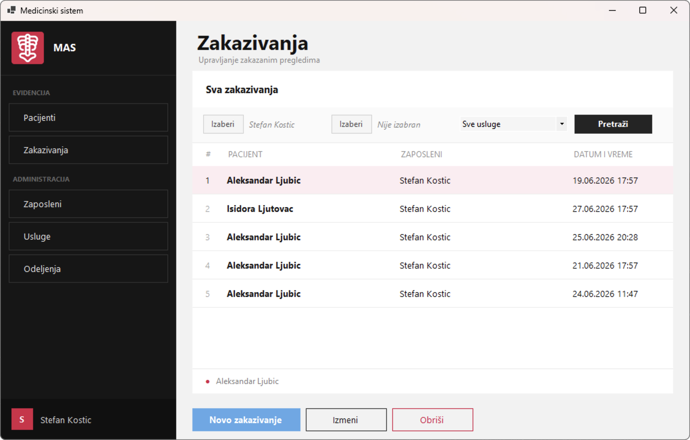
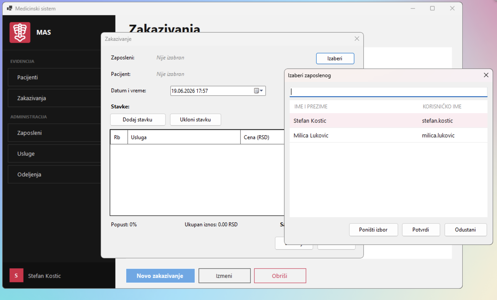

# Medical Appointment System

A Windows desktop application for managing medical appointments, patients, employees, services, and departments.

## Screenshots

## Features

- **Employee login** — staff authenticate with a username and password before accessing the system
- **Patient management** — manage patient records including personal details, contact info, and patient category
- **Patient categories** — assign patients to categories (e.g. pensioner, child) that carry a discount percentage applied at billing
- **Appointment management** - manage appointments by selecting a patient, employee, date/time, and one or more services; the total and discounted amount are calculated automatically
- **Service management** — maintain a catalogue of billable medical services with names and prices
- **Department management** — manage hospital departments

## Tech Stack

- **Language / Framework** — C# / .NET, Windows Forms
- **Database** — Microsoft SQL Server Express
